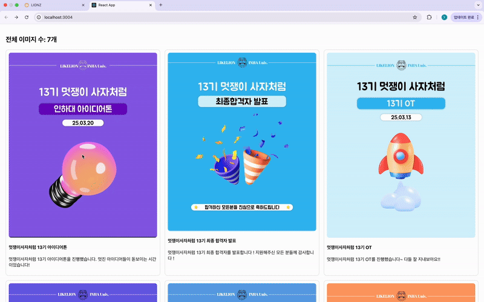
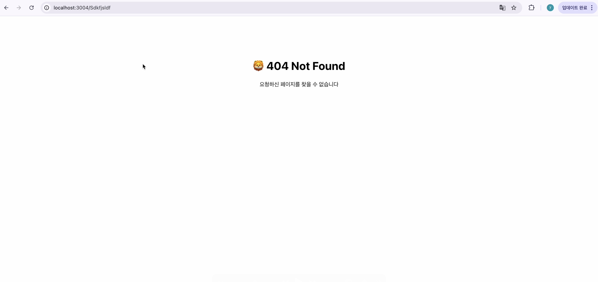

# 🦁 멋쟁이사자처럼 13기 클론코딩 과제

## 프로젝트 소개
- 멋쟁이사자처럼 인스타그램 스타일 클론 프로젝트
- 게시글 리스트, 상세 페이지, 댓글 기능 구현

## 사용 기술
- React
- React Router
- Axios
- Local JSON 서버

## 기능 요약
- 메인 페이지에서 게시글 목록 조회
- 각 게시글 클릭 시 상세 페이지 이동
- 댓글 작성 및 삭제 기능
- 존재하지 않는 URL 진입 시 404 페이지로 이동

## 시연 영상

## 느낀점
: 처음부터 직접하려고 하니 너무 어려웠습니다 .. 
무의식적으로 create-react-app을 하였는데 .. 
다음엔 vite로 시작해야지 라는 생각이 들었고!
그리고 .. 열심히 만들었는데.. 화면이 그닥 인스타그램 같지 않고 ..
인스타그램 와이파이 끊긴 버전 같아서 분발해야할 것 같다고 느꼈습니다ㅜㅜ ~ 그리고 레이아웃 분리된 코드 구성 !이 되도록 다시 작성하고싶다고 
느꼇습니다 제일 어려웟던 부분은 axios 였습니다 전체적으로 처음해봐서
시행착오가 많았던 것 같습니다 !
그래도 가장 배운게 많은 과제였던거 같습니다 ! 

